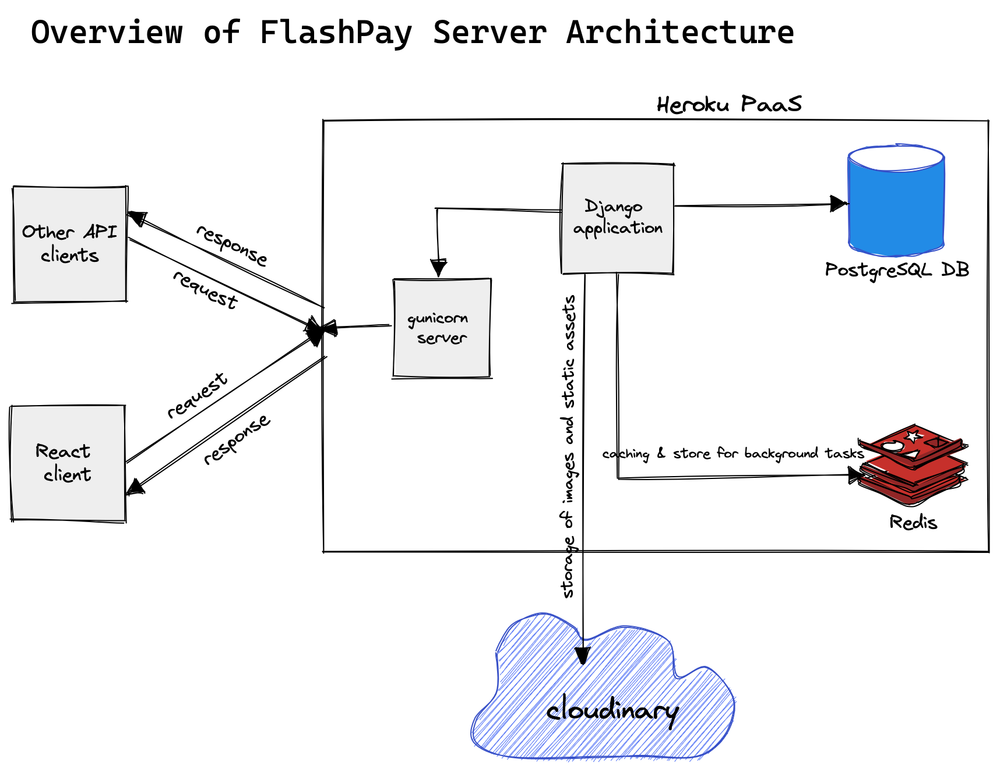
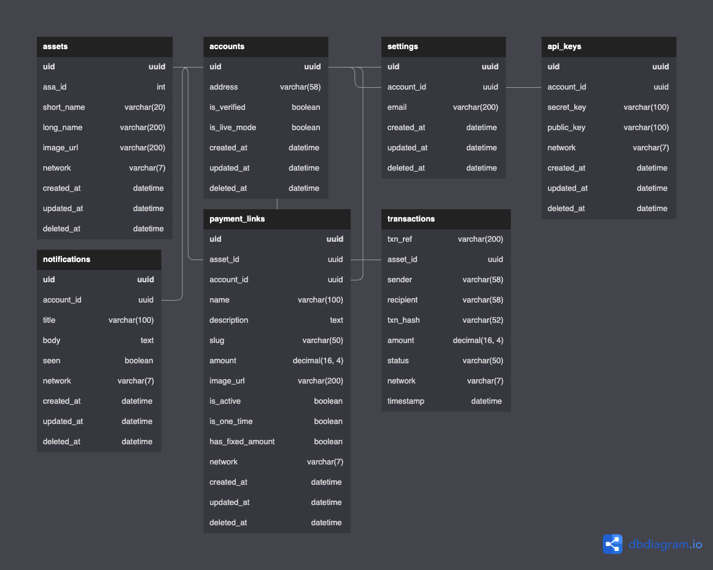
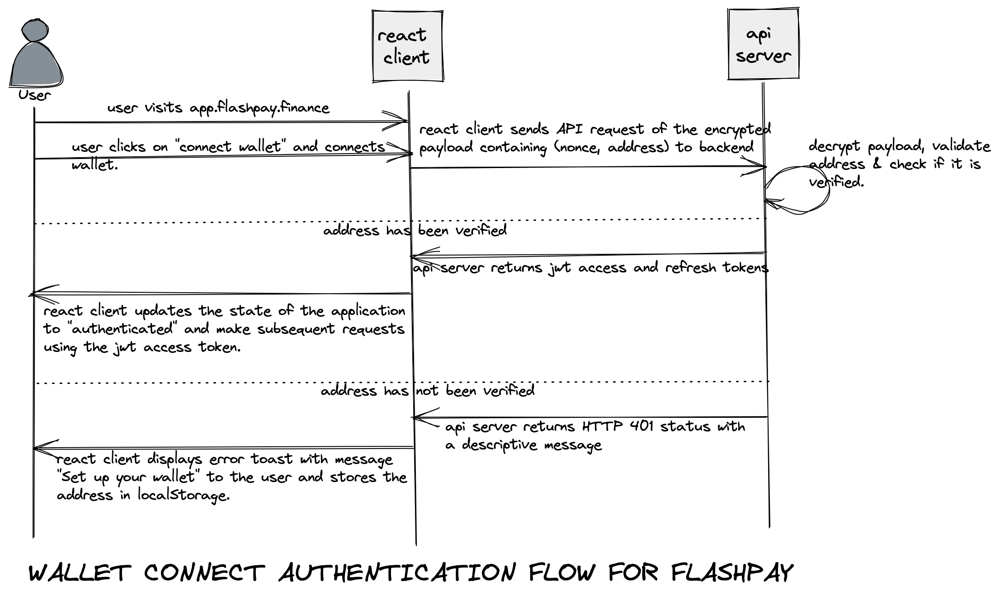
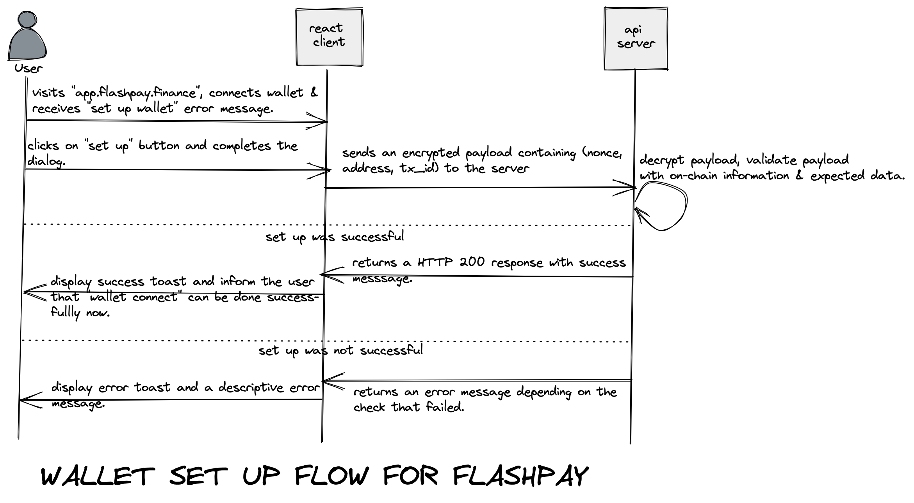
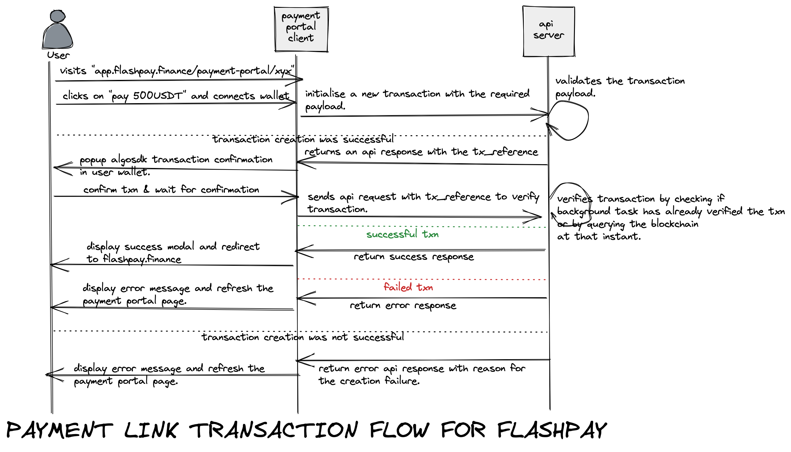

# FlashPay Design Documentation
This document outlines the design for a payment platform on the Algorand blockchain.


## TERMINOLOGIES

* UUID - Universal Unique Identifier(The one talked about in this doc is v4).
* DRF - Django Rest Framework. Learn more [here](https://www.django-rest-framework.org/)
* Fernet encryption


## USERS

This application targets two types of users namely: Developers & Non-technical users who just love crypto!

* Developers - To use our APIs to further improve payments on Algorand and the crypto ecosystem at large!

* Non-technical users/Crypto Lovers - To accept payments with little or no hassle!

* Lastly, anyone!


## ARCHITECTURE

This application consists of two parts -- the frontend part(built using ReactJS) and the backend part(built using the Python framework, Django and DRF for APIs). As a caution, the focus of the backend is solely on describing the backend aspect of the system.

A simple pictorial overview of the backend architecture can be found below:


1. **DATABASES**: The choice of database for this application was PostgreSQL. The reason for this is that the web framework(Django) has great support for it. It is also battle-tested and has great community support. Also, our choice of cloud provider easily supports PostgreSQL. The DB schema used for this application can be found below.


**N.B: The schema is subject to change. If at any point that happens, the image above will be updated.**

2. **REDIS SERVER**: The use of Redis is for caching and also to serve a datastore for periodic tasks.

3. **CLOUDINARY**: Cloudinary is used as a CDN to host the assets supported on the platform, user uploaded images and other static assets. The reason for this choice was as a result of their API which allows easy manipulation of images stored on the platform.

4. **GUNICORN**: Gunicorn here, servers as a WSGI server as the development Django server cannot be used in production. There were other alternatives such as uWSGI but given the team is more familiar with Gunicorn, it was an easy decision.

5. **HEROKU**: This is a no-brainer. It saves us a lot of engineering time and enables us to focus on churning out features rather than setting up a perfect server environment and various optimisations. Plus, it comes with fantastic add-ons to make bootstrapping an application from development to production easy as writing a couple of lines and inputting a few configs. We ♥️ Heroku.

6. **ALGOEXPLORER NODE & INDEXER APIS**: These are used to query the Algorand blockchain to retrieve on-chain data to verify and confirm certain actions on our platform. The reason for this was because it's free and so far we've not been hit by rate limiting. If for some reason in the future, we hit a limitation, spinning up our private node and indexer will be our next line of action.

7. **LOGGING & MONITORING**: For logging, we went with Sentry for logging exceptions in the backend & Papertrail for server logs in general. For monitoring, Scount APM was our choice.


### Authentication
Primarily, the authentication flow consists of two endpoints.
- `/api/v1/accounts/init`: Used to verify that a user owns the wallet used to create an account on the platform.
- `/api/v1/accounts/connect`: Used for verified accounts to generate JWTs to access protected endpoints.


#### WALLET CONNECT(`/api/v1/accounts/connect`)

To get an idea of how the flow works, take a look at this sequence flow diagram below


With an idea of how the flow works, let's dive in further. When a user connects their wallet on the client-side, the client sends an API request that contains a payload of:
- Nonce: A random string generated by the client.
- Address: The address of the wallet connected.

This payload is encrypted and base64 encoded before being sent to the API server to prevent any form of data leak.
```js
// this is an example.
// https://github.com/csquared/fernet.js Fernet JS lib
import fernet from "fernet";

const fernetSecret = new fernet.Secret(process.env.REACT_ENCRYPTION_KEY)
const fernetToken = new fernet.Token({
    secret: fernetSecret,
    ttl: 0
})

const nonce = Math.random().toString(36).slice(2, 7);
const walletAddress = "FPOU46NBKTWUZCNMNQNXRWNW3SMPOOK4ZJIN5WSILCWP662ANJLTXVRUKA";

const encryptedPayload = fernetToken.encode(`${nonce}, ${walletAddress}`);
const b64encryptedPayload = btoa(encryptedPayload);  // payload sent in the API request.
```
You might have noticed `process.env.REACT_ENCRYPTION_KEY`, well that's the Fernet encryption key used by the client and the server to ensure data is encrypted and decrypted successfully.

Upon receipt of this request on the backend, the payload is decrypted as below
```py
from base64 import b64decode

from cryptography.fernet import Fernet

from django.conf import settings

payload = "xyz"
b64_decoded_payload = b64decode(payload.encode())
fernet = Fernet(settings.ENCRYPTION_KEY.encode())
decrypted_payload = fernet.decrypt(b64_decoded_payload).decode()  # decrypted payload
```
Upon the decryption, the wallet address is extracted and a sanity check is performed to ensure it's a valid Algorand address. Afterwards, we check if it has been verified i.e successfully passed `/api/v1/accounts/init` controller's checks. If it is, a JWT is returned to make future access to protected endpoints easier. If not, an HTTP 401 UNAUTHORIZED ERROR is returned with a message telling the user to complete wallet setup.


#### WALLET SETUP(`/api/v1/accounts/init`)

To get an idea of how the flow works, take a look at this sequence flow diagram below.


The wallet address is stored locally(local storage) if a wallet connect flow fails. Setting up a wallet simply means passing a nonce generated on the client-side as a note to a zero $ALGO transaction to an address we control. After this transaction is confirmed(an Algorand block takes approximately 4 seconds to be mined), an API request is sent from the client-side to the backend server with an encrypted base64 encrypted payload containing the following:
- Nonce: A random string generated on the client.
- Address: The wallet address stored locally and also counts as the sender of the ZERO ALGO.
- Transaction Hash: The transaction hash of the ZERO ALGO sent to our address.

Upon receipt on the encrypted base64 payload on the backend, it is decrypted and the nonce, address & transaction hash are extracted. The following checks are done with the extracted data:
- Checks if the address exists in our DB i.e has been previously connected.
- Checks if the address has already been verified.
- Checks if the transaction hash represents a valid transaction on the Algorand blockchain.
- Checks if the transaction type is of **"pay"**. Only transfer of ALGO is represented in that type.
- Checks that the sender in the transaction matches the address provided in the payload.
- Checks that the receiver in the transaction matches our address.
- Checks that the note in the transaction matches the nonce provided in the payload.

If all the aforementioned checks pass, the account is then verified and can successfully connect their wallet subsequently using the `api/v1/accounts/connect` endpoint.

**Note: The reason for this complexity is as a result of the limitation imposed by Algorand based wallets. For other blockchains e.g Ethereum(MetaMask as a case study), a message can be easily signed off-chain and the authenticity can be checked server-side i.e comparing both messages.**


### Assets
Assets are referred to Algorand Standard Assets(ASAs) with the exception of the native token(Algorand itself) on the Algorand blockchain. We maintain a repository of assets we support which is a forked version of [tinymanorg/asa-list](https://github.com/tinymanorg/asa-list). Currently, we support a limited number of ASAs(USDC, USDT) and ALGO. The support for other ASAs will increase in the future.

Assets images are uploaded to our Cloudinary using Github workflows.


### Transactions
Transactions are a vital aspect of any payment system or exchange platform as it is to FlashPay and its users. Below is a sample of how transactions work in the context of a payment link.



## Credits
**FlashPay Team, located across 🇳🇬.**

Algorand Foundation.

[TinyMan Design Docs](https://github.com/tinymanorg/docs/blob/main/design-doc.md) for inspiration.